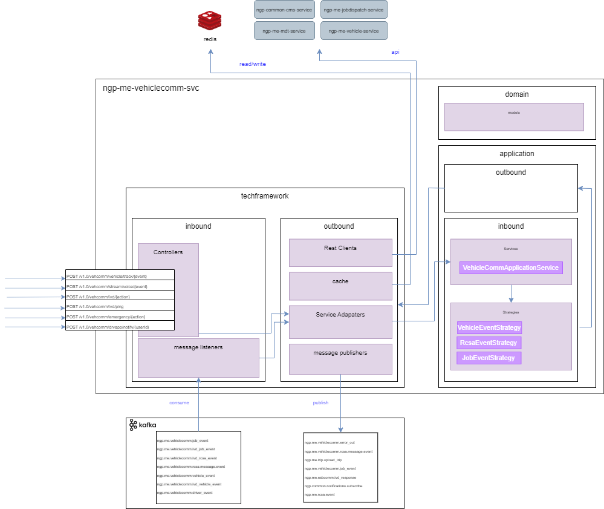
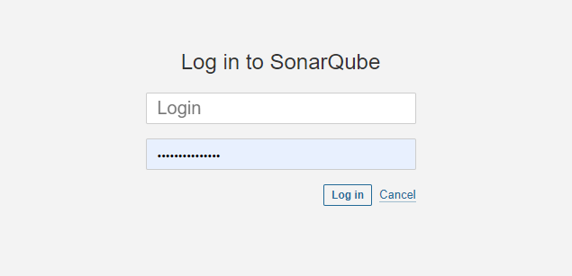
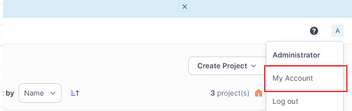
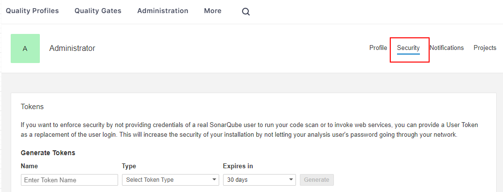
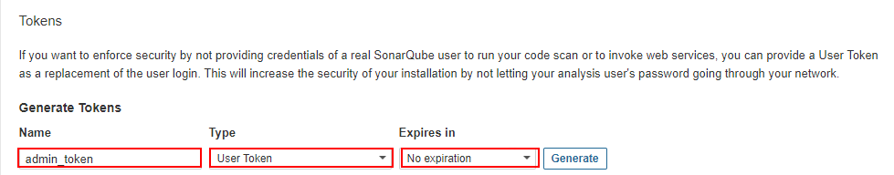
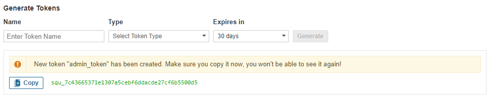
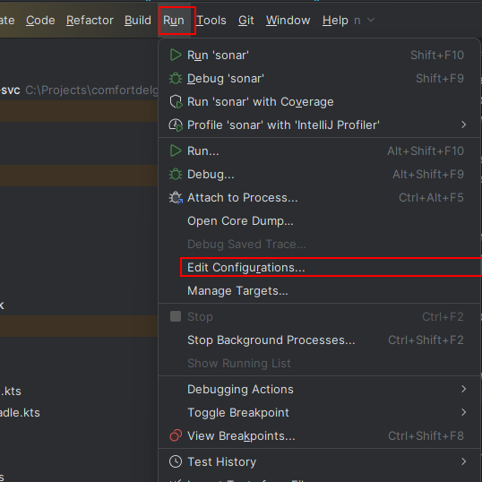
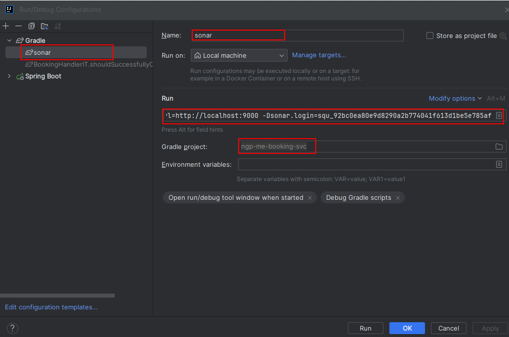

# NGP ME Vehiclecomm Service
## Table of Content
1. [Introduction](#1-introduction)
2. [Module Level Architecture](#2-module-level-architecture)
3. [Developer Guide](#3-developer-guide)   
   3.1. [Folder Structure](#31-folder-structure)   
   3.2. [Running Locally](#32-running-locally)   
   3.3. [Local SonarQube Scan](#33-local-sonarqube-scan)
4. [CI/CD](#4-cicd)
5. [Swagger Links](#5-swagger-links)
6. [Terminologies](#6-terminologies)

## 1. Introduction
<a name="1-introduction"></a>
A top level view of the role that ngp-me-vehiclecomm-svc plays in the Mobility Engine is illustrated in the following diagram:   



## 2. Module Level Architecture
<a name="2-module-level-architecture"></a>
--To be populated later--

## 3. Developer Guide
<a name="3-developer-guide"></a>
### 3.1. Folder Structure
<a name="31-folder-structure"></a>
```
ngp-me-vehiclecomm-svc/
  - application/             ## Part of hexagonal architecture. Contains business logic.
  - codebuild/               ## Contains AWS codebuild yaml files  
  - deployment/              ## Contains files which allow you to do deployment. docker-compose, kubernetes etc.
  - docs/                    ## Assets (images/drawio) required for documentation.
  - domain/                  ## Part of hexagonal architecture. Contains domain data objects. 
  - gradle/                  ## Contains gradle binaries. In most cases, do not touch
  - techframework/           ## Part of hexagonal architecture. Contains infrastructure/adapter classes.
```
Developers are encouraged to read up on the hexagonal architecture concept, and to ensure that classes are put into the
appropriate modules. Additional information can be found at the following links:
- [Medium Article - Hexagonal Architecture](https://masne.medium.com/hexagonal-architecture-part-1-b8357d3ee17d)
- [Medium Article - Implementing a hexagonal architecture](https://medium.com/swlh/implementing-a-hexagonal-architecture-bcfbe0d63622)
- [CDG Confluence - Hexagonal - Best Practices](https://comfortdelgrotaxi.atlassian.net/wiki/spaces/NGP/pages/1123261534/Hexagonal+-+Best+Practices)

### 3.2. Running Locally
<a name="32-runninng-locally"></a>
Local deployment can be performed via the use of docker-compose
The main docker-compose file for the system is located in `deployment/docker-compose` and consists of the following:

```
deployment/
  - docker-compose/
    - docker-compose.yml
```

Unlike kubernetes, docker does not support concepts such as ingress nor load-balancing.
As such, there is a need for manual management of port mapping within the host machines.

The current port mappings are as follows:

| S/N | Service              | Description                   | Host Machine Port           | Container Port            | Profile  |
|-----|----------------------|-------------------------------|-----------------------------|---------------------------|----------|
| 1   | kafka-ui             | Management Portal for Kafka   | 19000                       | 8080                      | kafka    |
| 2   | kafka-zookeeper0     | State Management DB for Kafka | 19001                       | 2181                      | kafka    |
| 3   | kafka0               | Kafka Databus                 | 19002<br/> 19003<br/> 19004 | 9092<br/> 9997<br/> 29092 | kafka    |
| 4   | kafka-schemaregistry | Kafka Schema Registry         | 19005                       | 8085                      | kafka    |
| 5   | redis                | Redis Database                | 19007                       | 6379                      | redis    |


Note that each service has also been tagged with a docker-compose profile.   
For example, do run just the kafka services, you can execute the following command:
```
docker-compose -p vehiclecomm -f deployment/docker-compose/docker-compose.yml --profile kafka up -d
```

To run all services, you can just run with the profile all  argument:
```
docker-compose -p vehiclecomm -f deployment/docker-compose/docker-compose.yml --profile all up -d
```

### 3.3. Local SonarQube Scan
<a name="33-local-sonarqube-scan"></a>
SonarQube is a static code analysis tool that is used to ensure that code quality is maintained.    
While CDG has a sonarcloud subscription, it is accessible only from our main build environment. This is for security reason.

For developers working on their own feature branches, it is recommended that they perform a local sonarqube scan to
ensure that their code is of acceptable quality.

To perform a local sonarqube scan, you will need to have the following steps performed:
#### 3.3.1. Install SonarQube Server
For x86 systems:
```
docker-compose -p tools -f deployment/docker-compose/docker-compose-devtools.yml --profile x86 up -d
```

For ARM systems:
```
docker-compose -p tools -f deployment/docker-compose/docker-compose-devtools.yml --profile arm up -d
```

#### 3.3.2. Log into your local SonarQube Server
Navigate to the following URL: [http://localhost:9000/](http://localhost:9000/)    
The default username and password is `admin` and `admin` respectively.   


#### 3.3.3. Generate a sonarqube token
Click on the admin menu at the top right-hand-side of the page.   
Select "My Account" from the dropdown menu.   


#### 3.3.4. Navigate to the security tab


#### 3.3.5. Generate a token
Generate an admin token with the following permissions:   


#### 3.3.6. Copy the token
Copy the token and store it somewhere safe. You will not be able to retrieve it again.   


#### 3.3.7. IntelliJ - Add New Run Configuration
Navigate to Run -> Edit Configurations   


#### 3.3.8. Configure gradle task
Configure the gradle task as follows with the token that you have generated earlier:   


```
:sonar -Dsonar.projectKey=ngp-me-vehiclecomm-svc -Dsonar.host.url=http://localhost:9000 -Dsonar.login=
```

#### 3.3.9. Run the gradle task


#### 3.3.10. View the results
Navigate to the following URL: [http://localhost:9000/](http://localhost:9000/) to the result.


## 4. CI/CD
<a name="4-cicd"></a>
--To be populated later--


## 5. Swagger Links
<a name="5-swagger-links"></a>
--To be populated later--

## 6. Terminologies
<a name="6-terminologies"></a>
--To be populated later--